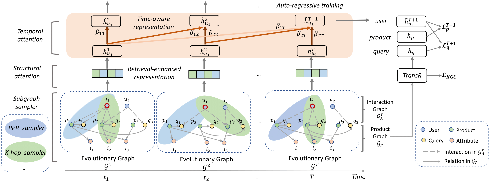

# RETE_TheWebConf_2022

A PyTorch implementation of "RETE: Retrieval-Enhanced Temporal Event Forecasting on Unified Query Product Evolutionary Graph" (TheWebConf 2022). [[paper](https://arxiv.org/abs/2202.06129)]

Contact: Ruijie Wang (ruijiew2@illinois.edu)



# Abstract

With the increasing demands on e-commerce platforms, numerous user action history is emerging. Those enriched action records are vital to understand users' interests and intents. Recently, prior works for user behavior prediction mainly focus on the interactions with product-side information. However, the interactions with search queries, which usually act as a bridge between users and products, are still under investigated. In this paper, we explore a new problem named temporal event forecasting, a generalized user behavior prediction task in a unified query product evolutionary graph, to embrace both query and product recommendation in a temporal manner. To fulfill this setting, there involves two challenges: (1) the action data for most users is scarce; (2) user preferences are dynamically evolving and shifting over time. To tackle those issues, we propose a novel Retrieval-Enhanced Temporal Event (RETE) forecasting framework. Unlike existing methods that enhance user representations via roughly absorbing information from connected entities in the whole graph, RETE efficiently and dynamically retrieves relevant entities centrally on each user as high-quality subgraphs, preventing the noise propagation from the densely evolutionary graph structures that incorporate abundant search queries. And meanwhile, RETE autoregressively accumulates retrieval-enhanced user representations from each time step, to capture evolutionary patterns for joint query and product prediction. Empirically, extensive experiments on both the public benchmark and four real-world industrial datasets demonstrate the effectiveness of the proposed RETE method.

# 1.0 Requirements

**Step 0**: Create a virtual environment with Python 3.8. 

**Step 1**: Install PyBind11 to link the C++ based sampler with the PyTorch based trainer. The `./para_graph_sampler/graph_engine/backend/ParallelSampler.*` contain the C++ code for the PPR and k-hop samplers. The `./para_graph_sampler/graph_engine/backend/pybind11/` directory contains a [copy of PyBind11](https://github.com/pybind/pybind11). 

Before training, we need to build the C++ sampler as a python package, so that it can be directly imported by the PyTorch trainer. To do so, you need to install the following: 

* `cmake` (our version is 3.18.2. Can be installed by `conda install -c anaconda cmake`)
* `ninja` (our version is 1.10.2. Can be installed by `conda install -c conda-forge ninja`)
* `pybind11` (our version is 2.6.2. Can be installed by `pip install pybind11`)
* `OpenMP`: normally openmp should already be included in the C++ compiler. If not, you may need to install it manually based on your C++ compiler version. 

Then build the sampler. Run the following in your terminal

```
pip install ./para_samplers
```

**Alternatively, you may run the following to automate the above process**:

```
bash install.sh
```

**Step 2**: Install all the other Python packages in your virtual environment. 

* pytorch==1.7.1 (CUDA 11)
* Pytorch Geometric and its dependency packages (torch-scatter, torch-sparse, etc.)
    * Follow the [official instructions](https://pytorch-geometric.readthedocs.io/en/latest/notes/installation.html) (see the "Installation via Binaries" section)
    * We also explicitly use the `torch_scatter` functions to perform some graph operations for shaDow. 
* ogb>=1.2.4
* dgl>=0.5.3
* numpy>=1.19.2
* scipy>=1.6.0
* scikit-learn>=0.24.0
* pyyaml>=5.4.1
* argparse
* tqdm

# 2.0 Dataset
## 2.1 Yelp
* Create the data folder:
```
mkdir data
```
* Dowoload yelp dataset from [Goodle Drive](https://drive.google.com/drive/folders/1SePX0wEP0jauWy02Vcbpp6PVtldnOzNI?usp=sharing) into data folder.


## 2.2 Prepare Your Own Data

* ``` adjs.pickle```: A list of sparse matrix of adj matrix in each time step;
* ``` asin_gt.npy ```: A list of user-product interactions in each time step;
* ``` query_gt.npy ```: A list of query-product interactions in each time step;
* ``` kg.npy ```: KG file, (head, tail, relation (optional));
* ``` query.npy ```: A list of query ID;
* ``` asin.npy ```: A list of product ID;
* ``` user.npy ```: A list of user ID;
* ``` nodes.npy ```: A list of node ID;
* ``` feats.npy ```: A list of pretrain feature in each time step;


# 3.0 Usage

```
python train.py [-h] [--local_rank LOCAL_RANK] [--device DEVICE] [--seed SEED] [--data_name [DATA_NAME]] [--data_dir [DATA_DIR]] [--time_step TIME_STEP] [--use_pretrain USE_PRETRAIN] [--pretrain_embedding_dir [PRETRAIN_EMBEDDING_DIR]]
                [--pretrain_model_path [PRETRAIN_MODEL_PATH]] [--rec_batch_size REC_BATCH_SIZE] [--kg_batch_size KG_BATCH_SIZE] [--test_batch_size TEST_BATCH_SIZE] [--entity_dim ENTITY_DIM] [--relation_dim RELATION_DIM]
                [--kg_l2loss_lambda KG_L2LOSS_LAMBDA] [--rec_l2loss_lambda REC_L2LOSS_LAMBDA] [--margin MARGIN] [--lr LR] [--n_epoch N_EPOCH] [--stopping_steps STOPPING_STEPS] [--rec_print_every REC_PRINT_EVERY]
                [--kg_print_every KG_PRINT_EVERY] [--evaluate_every EVALUATE_EVERY] [--K K] [--sampler_config SAMPLER_CONFIG]
```

# Acknowledgement
The implementation of subgraph samplers is modified from shaDow_GNN (https://github.com/facebookresearch/shaDow_GNN). We sincerely thank them for their contributions.

# Cite
For more information, please refer to the [paper](https://arxiv.org/abs/2202.06129).

If you find this repo to be useful, please cite our paper. Thank you.

```
@inproceedings{Wang2022RETE,
author = {Wang, Ruijie and Li, Zheng and Zhang, Danqing and Yin, Qingyu and Zhao, Tong and Yin, Bing and Abdelzaher, Tarek},
title = {RETE: Retrieval-Enhanced Temporal Event Forecasting on Unified Query Product Evolutionary Graph},
year = {2022},
booktitle = {The Web Conference.}
}
```

# License
This project is licensed under the Apache-2.0 License and CDLA-Permissive 2.0 license.


